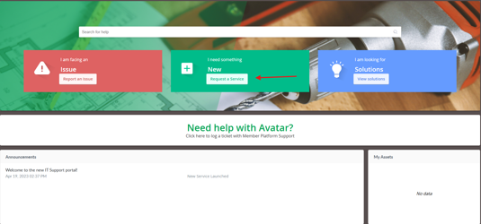
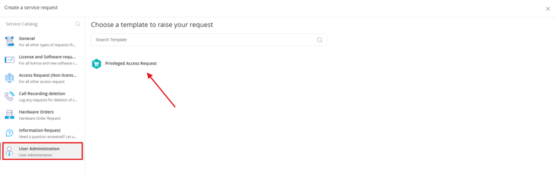
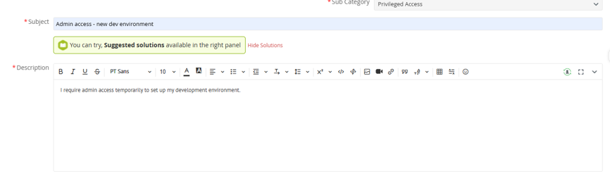
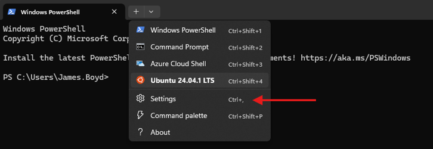
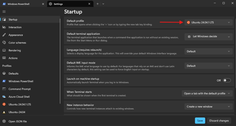
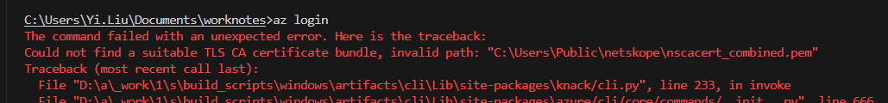
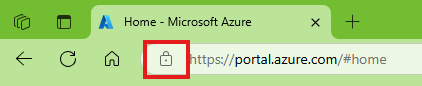
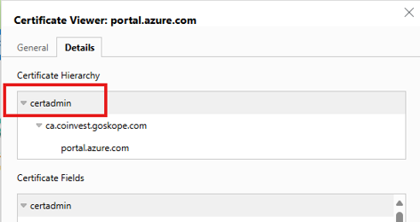

# Overview

This document aims to streamline the setup process for a developer laptop. It expands on the already established
documentation in the backend guide, ordered for an easier step-through process. The end goal is that a new developer can
follow this guide step by step and be ready with minimal assistance.

# Access Requests

## Local Admin Access

> [!NOTE]
>
> #### **A lot of the setup process will require elevated privileges.**
>
> Many of the systems which need to be set up will require local admin access on your device. You can request
> temporary access within <https://helpdesk.leaveplus.com.au>.

#### Create a new ticket (Request a Service)



#### Under “User Administration”, select “Privileged Access Request”



#### Fill out a description containing the reason for access (e.g. required for development setup)

Use the following exact wording for your description:
> Local administrator access is required to perform developer workstation setup. This includes installing WSL 2 (
> Ubuntu-24.04), Docker, Node.js (via NVM), Python (via uv), Git, Git Credential Manager, and installing the Netskope
> STAgent client for secure development environment access.



## Azure DevOps (ADO)

Azure DevOps is used to host our repositories here: <https://dev.azure.com/leaveplus>

If you do not have access to ADO, speak to Johan Steenkamp to request access.

## GitHub Co-Pilot

Ask Johan Steenkamp for GitHub Co-Pilot for VSCode integration.

## Azure

Raise a ticket with <https://helpdesk.leaveplus.com.au> to request Azure access. Reference a team member who performs a
similar role to serve as a reference for the type of permissions you require (e.g., "I need Azure access similar to
X's").

## Miro

Miro is used for diagramming and brainstorming: <https://miro.com/app/dashboard/>

If Miro is not already set up for you, speak to Kylie Williams to request access.

## Datadog

Datadog is a monitoring and analytics tool for information technology (IT)
services: <https://us3.datadoghq.com/dashboard/lists>

Try logging into the above links and raise a request with <https://helpdesk.leaveplus.com.au> if there are any issues
accessing them (requesting to be added to the correct AD groups).

## Windows certificates

Set a User Environment Variable in Windows:

`SSL_CERT_FILE=C:\Users\Public\netskope\netskope-cert-bundle.pem`

This should let you use `uv` for Python development on Windows, if you ever need to.

# Setting up WSL and Development Environment

The onboarding and setup process for WSL, Git, Docker, Node.js, Python, and Netskope is fully automated using a
PowerShell bootstrap script and an Ansible playbook.

### Prerequisites

Before running the script, ensure you have requested and received confirmation for:

1. **Local Admin Access** (see [Local Admin Access](#local-admin-access))
2. **Netskope Auth Token**: Ask the infra team (John Sneddon or Vishawdeep Pathania) to “enable auth token for WSL
   STAgent installation”. **Do not run the script before they confirm.**

### Automated Installation

To execute the automated setup:

1. Open Windows PowerShell as **Administrator**.
2. Navigate to the directory containing the onboarding script.
3. Run the bootstrap script:
   ```powershell
   Set-ExecutionPolicy -Scope Process -ExecutionPolicy Bypass; .\bootstrap.ps1
   ```
4. Follow the prompts. The script will automatically:
    - Verify/install Git on Windows.
    - Verify/install WSL 2 and the `Ubuntu-24.04` distribution.
    - Bootstrap Ansible inside WSL.
    - Set up the Git Credential Manager helper to share Windows SSO with WSL.
    - Clone the onboarding repository inside WSL.
    - Run the Ansible playbook to configure:
        - Timezone to Melbourne.
        - System packages and dependencies (e.g. ca-certificates, curl, unzip, etc.).
        - Docker CE (and add your user to the `docker` group).
        - Node.js (via NVM).
        - Miniforge and `uv` (for Python environment management).
        - Netskope STAgent client (registered with your user email).

### Re-install the WSL distro

It is possible to blow away the whole distribution and start from scratch.
**Beware:** it will remove all your files inside the WSL filesystem, so make sure you have pushed your Git repositories
beforehand and preserved any other files that you do not want to lose (e.g., `.env` files).

You can preserve everything in Windows, including installed packages and configurations, by running the following in
PowerShell:

`wsl --export Ubuntu-24.04 C:\Users\<your name>\wsl_backup.tar`

Exit all WSL terminals, then from Windows "Installed apps" uninstall the distribution, then from PowerShell or CMD, run:

```bash
wsl --unregister Ubuntu-24.04
```

After that, you can restart the automated installation process above.

### Disable Windows Docker Desktop integration with WSL

If you have Docker Desktop installed on Windows, it can interfere with WSL's Docker. Make sure the *WSL 2 integration*
is disabled for your distribution in Docker Desktop under “Settings -> Resources -> WSL Integration”. There are two
separate settings (one for the default distribution and one per-distribution); disable both.

### Restart WSL

Exit all WSL terminals, VS Code, and the Command Prompt / PowerShell windows where you ran the script. Wait 15 seconds,
and then restart WSL.

**Note** On restart, it should take a good few seconds to start now. If it’s immediate - exit and let it rest longer.

### Cloning from ADO in WSL

After the above setup, you can clone ADO repositories using HTTPS URLs instead of SSH, which integrates with Windows
SSO. There is no need for SSH keys in this setup.

It is recommended to clone your Git repositories inside WSL on the Linux filesystem (e.g., under `~/projects`) instead
of the Windows filesystem (under `/mnt/c/Users/...`). This avoids CRLF line ending issues and runs significantly faster.

```bash
mkdir ~/projects
cd ~/projects
git clone https://leaveplus@dev.azure.com/leaveplus/DeliveryApplications/_git/<REPO>
```

# Installing Azure Tools

## Windows

Download the following tools for Azure (using **Windows Command Prompt or PowerShell**):

#### [Azure Functions Core Tools](https://github.com/Azure/azure-functions-core-tools?tab=readme-ov-file#v4-3)

```bash
winget install Microsoft.Azure.FunctionsCoreTools
```

#### [Azure CLI](https://learn.microsoft.com/en-us/cli/azure/install-azure-cli-windows?tabs=winget)

```bash
winget install -e --id Microsoft.AzureCLI
```

## WSL

[Install the Azure CLI on Linux | Microsoft Learn](https://learn.microsoft.com/en-us/cli/azure/install-azure-cli-linux?view=azure-cli-latest&pivots=apt)

```bash
curl -sL https://aka.ms/InstallAzureCLIDeb | sudo bash
```

# Optional Configurations and Tools

### Set up Windows Terminal to use WSL Ubuntu

Windows Terminal by default uses PowerShell. Open up the settings, and under Startup, set the default profile to the new
WSL distribution just set.



### Edge/Chrome Extensions

See below for a list of useful Edge/Chrome extensions to assist with development. Feel free to extend this list with any
additional extensions you find useful:

* [React Developer Tools](https://microsoftedge.microsoft.com/addons/detail/react-developer-tools/gpphkfbcpidddadnkolkpfckpihlkkil)
* [LastPass](https://chromewebstore.google.com/detail/lastpass-free-password-ma/hdokiejnpimakedhajhdlcegeplioahd?hl=en)

### Install Apps from Windows Company Portal

You can install software applications from the Windows Company Portal. Search for "Company Portal" in the Windows
taskbar.

# Troubleshooting

**Issue**: Unable to connect from WSL to dev or sandbox Azure resources.

**Root Cause**: Netskope agent not running.

**Fix**: Run `nsclient show-status`.

**Issue**: The error "Could not find a suitable TLS CA certificate bundle" occurs when running Azure CLI commands in
Command Prompt, Windows PowerShell, or a WSL terminal.

```text
Try running:
unset REQUESTS_CA_BUNDLE

If this doesn't work, try the instructions below.
If that still doesn't work, please contact your squad teammates; it is possible configuration adjustments are needed for Netskope in WSL.
```



**Root Cause**:
[This Microsoft troubleshooting page](https://learn.microsoft.com/en-gb/cli/azure/use-azure-cli-successfully-troubleshooting?view=azure-cli-latest#work-behind-a-proxy)
explains the root cause, but its solution is incomplete.

**Solution**:

1. Go to <http://portal.azure.com> using any web browser. If it works, check if the connection is secure.



2. Export the root full-chain certificate (as `.crt` or `.pem`). **Note:** It must be the "full chain".



3. Append the exported certificate to the `cacert.pem` mentioned in the Microsoft troubleshooting page. Open both
   certificates in any text editor, and paste the exported certificate at the top of the `cacert.pem` content.
4. Create or update the `REQUESTS_CA_BUNDLE` variable with the full path of the appended certificate in your Windows
   Environment Variables. **Note:** You must be an Administrator on your laptop.
5. Reopen the terminal (no need to run as Administrator) and test it.

**Issue**: The error "ModuleNotFoundError: No module named 'xxxxxx'" occurs when running Azure Functions Python code on
a local laptop, even though the module is added to `requirements.txt` and is installed in your virtual environment.

**Root Cause**:
Python installed via the Microsoft Store sets `FunctionsCoreTools` to use the default Python interpreter, not the one in
your virtual environment. This cannot be overridden, even if you configure VS Code to use your local interpreter.

**Solution**:

1. Uninstall Python.
2. Reinstall Python using the official installer (MSI) provided by [python.org](https://www.python.org/).
3. Configure VS Code to use the new interpreter.
4. Restart your applications/terminal.
)